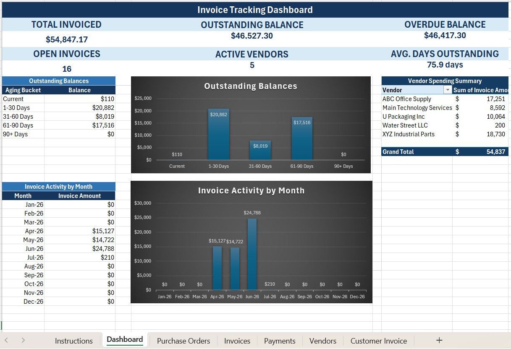
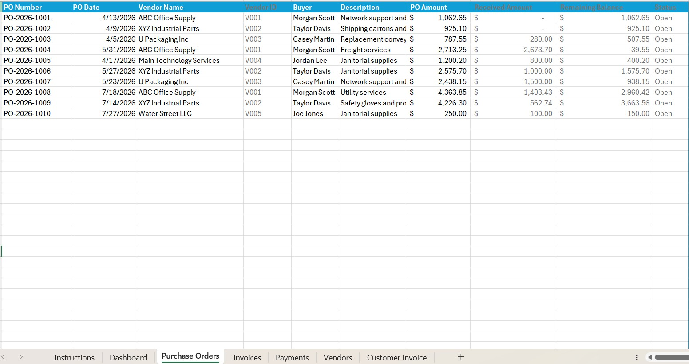
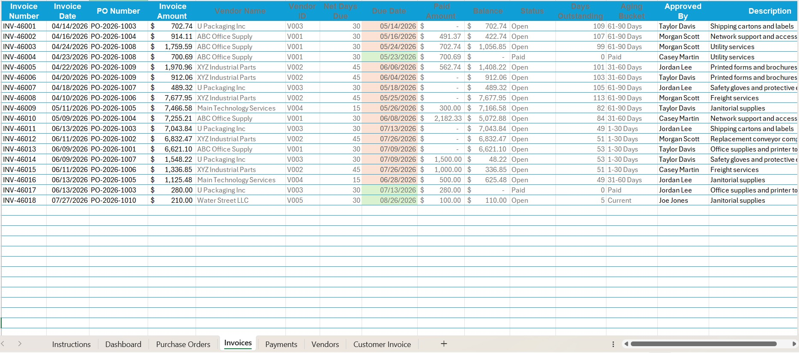
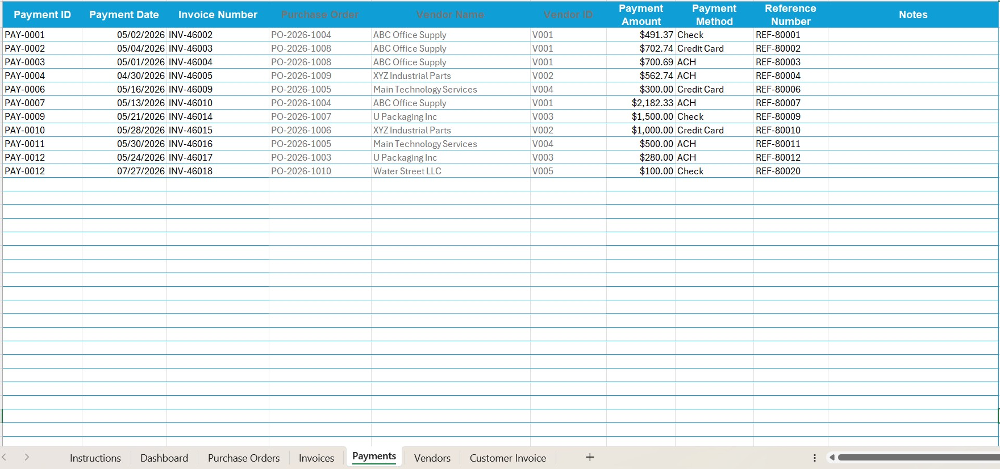

# Customer Billing & Invoice Management Workbook

An Excel-based solution that streamlines customer billing, invoice tracking, payment processing, and accounts receivable reporting for small businesses.

The workbook automates billing processes while providing clear visibility into outstanding balances, customer payment history, and aging information through interactive dashboards and reports.

---

## Overview

Managing customer invoices across multiple spreadsheets or manual processes can make it difficult to monitor payments, track balances, and produce accurate accounts receivable reports.

This workbook consolidates customer billing activities into a single Excel solution that simplifies invoice management and improves visibility into customer payment activity.

---

## Business Problem

Many small businesses struggle to:

- Create and track customer invoices
- Monitor customer account balances
- Record customer payments accurately
- Identify overdue invoices
- Produce accounts receivable reports
- Analyze payment trends

This workbook centralizes these activities into one organized and easy-to-use system.

---

## Features

### Customer Management

- Customer database
- Customer IDs
- Contact information
- Payment terms

### Invoice Management

- Record customer invoices
- Track invoice status
- Calculate customer balances
- Monitor invoice history

### Payment Tracking

- Record customer payments
- Apply payments to invoices
- Track partial payments
- Monitor outstanding balances

### Accounts Receivable Aging

Automatically categorizes outstanding balances into:

- Current
- 1–30 Days
- 31–60 Days
- 61–90 Days
- Over 90 Days

### Dashboard

Interactive dashboard displaying:

- Total Accounts Receivable
- Outstanding Invoices
- Overdue Balances
- Monthly Collections
- Customer Balances
- Payment Trends

---
## Screenshots

### Dashboard


### Purchase Order Tracking


### Invoice Tracking


### Payment Tracking


---
## Skills Demonstrated

- Microsoft Excel
- Power Query
- PivotTables
- Pivot Charts
- XLOOKUP
- SUMIFS
- Conditional Formatting
- Data Validation
- Dashboard Design
- Business Process Analysis

---

## Business Benefits

- Centralizes customer billing information
- Improves payment tracking
- Reduces manual reconciliation
- Supports faster collections
- Improves reporting accuracy
- Provides visibility into customer payment activity

---

## Repository Contents

```
Customer-Billing-Invoice-Management/
│
├── README.md
├── Billing System.xlsx
│
├── images/
│   ├── dashboard.jpg
│   ├── invoices.jpg
│   ├── purchase-orders.jpg
│   └── payments.jpg
```

---

## Future Enhancements

- Automated invoice generation
- Email-ready invoice export
- Sales tax calculations
- Customer payment forecasting
- KPI dashboard for collections

---

## Author

**Peter Deister**

This project demonstrates Microsoft Excel automation, customer billing, accounts receivable management, dashboard reporting, and business process improvement skills applicable to billing, accounting, finance, administrative, customer service, and office support roles.
````
